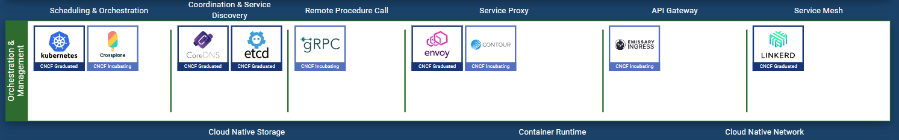
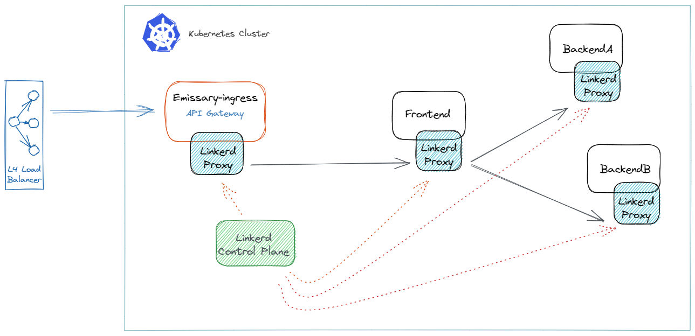

# Cloud Native Deployment Reference Architecture

## Microservice deployment

### Encourage make use of
- https://www.cncf.io/
- https://landscape.cncf.io/?project=graduated,incubating&zoom=120
- https://radar.cncf.io/

### Based on CNCF landscape

Component choice for cloud native deployment

### Suggested deployment

Our Kubernetes cluster consists of an **Ingress** and **API Gateway** based on **[Emissary-ingress](https://www.getambassador.io/products/api-gateway/)** The API gateway get  
traffic from a Layer-4 Cloud load balancer.

We propose a **Service Mesh** for microservice deployment. **[Linkerd](https://linkerd.io/)** is chosen for service mesh due to its simplicity. 

### Getting started

1. Get the infrastructure up and running
2. Deploy Sample microservice and learn to operate
3. Create own microservice