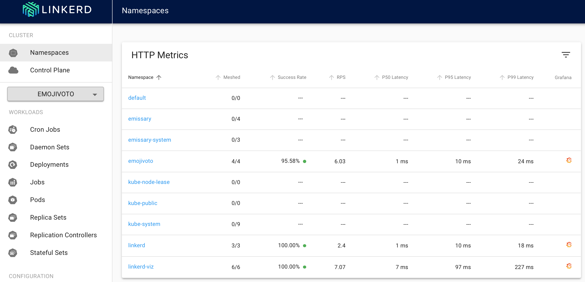
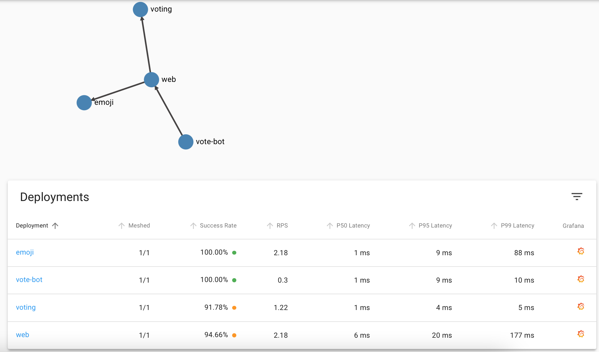

# Deploy sample app

1. Run ./deploy-app.sh to 

- Deploy emojivoto app with linkerd injected
- Add emisarry-ingress mapping to route incoming request to app
- More info https://buoyant.io/2021/05/24/emissary-and-linkerd-the-best-of-both-worlds/#:~:text=While%20Emissary%20is%20focused%20on,a%20developer%20focused%20Kubernetes%20platform.
- Ingress mappings guide https://www.getambassador.io/docs/emissary/latest/topics/using/intro-mappings/

2. Optionally linkerd proxy can be injected to emojivoto app to create a service mesh with folloeing command

kubectl get -n emojivoto deploy -o yaml \
  | linkerd inject - \
  | kubectl apply -f -

3. Run linkerd viz dashboard to vitualize the deployment

 Linkerd dashboard - deployments
 

 emojivoto app stats
 
