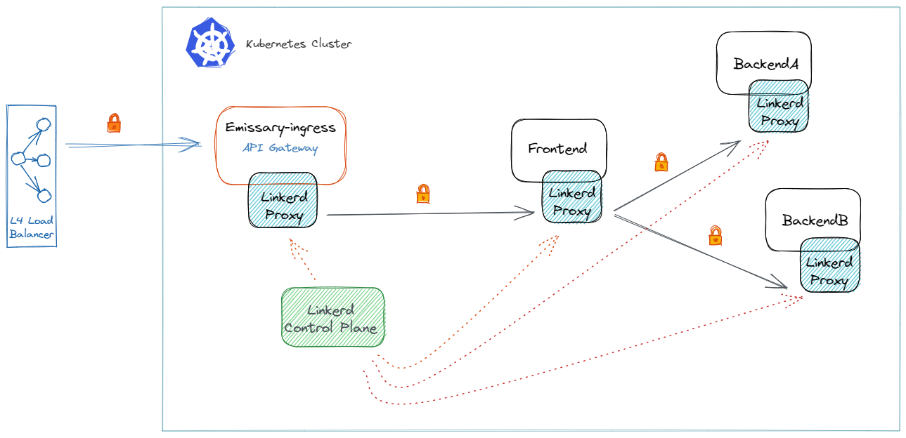

# Getting started with Lab infrastructure

## Overview

Common way to routing traffic to a kubernetes cluster is my deploying a in-cluster edge proxy or ingress controller along with an external load balancer. The topology looks like bellow. We also incoperated a service mesh to enable debugging, observability, reliability, and security to services without requiring any changes to your code.

Following articals describe the concepts well.
- https://www.getambassador.io/docs/emissary/latest/topics/concepts/kubernetes-network-architecture/
- https://buoyant.io/2021/05/24/emissary-and-linkerd-the-best-of-both-worlds/#:~:text=While%20Emissary%20is%20focused%20on,a%20developer%20focused%20Kubernetes%20platform.

## ./deploy.sh

To deploy the infrastructure simply run ./deploy.sh
It will perform similat procedure as decribed in https://linkerd.io/2.11/overview/

For exmple:
1. Install helm 
2. Install emissary-ingress
3. Create certs and scerets for emissary ingress 
   https://www.getambassador.io/docs/emissary/latest/howtos/tls-termination/
4. Tell Emissary-ingress to use this secret for TLS termination
5. Deploy linkerd
6. Expose linkerd dashboard through emissary ingress
7. Linkerd header mapping for emissary

## ./undeploy.sh

To undeploy the infrastructure run ./undeploy

Following will be done by the script.
1. Undeploy linkerd
2. Undeploy emissary-ingress
3. Remove emissary repo in helm
4. Remove emissary-ingress tls secret

## Test the deployment

- To access emissary-ingress try following URL
https://localhost/ambassador/v0/diag/

- To access linkerd dashboard, run following command in terminal
linkerd viz dashboard

### [Next step is to deploy a sample application](../apps/emojivoto/README.md)